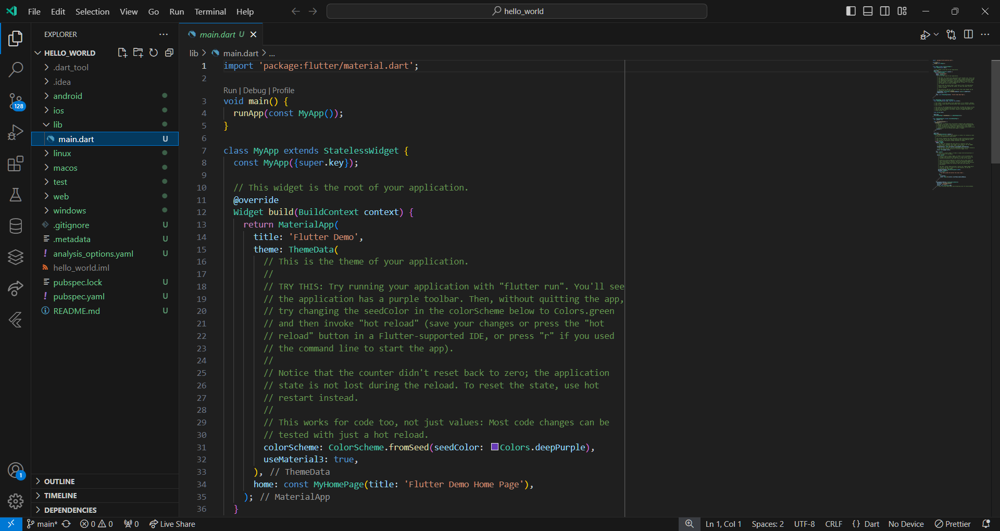
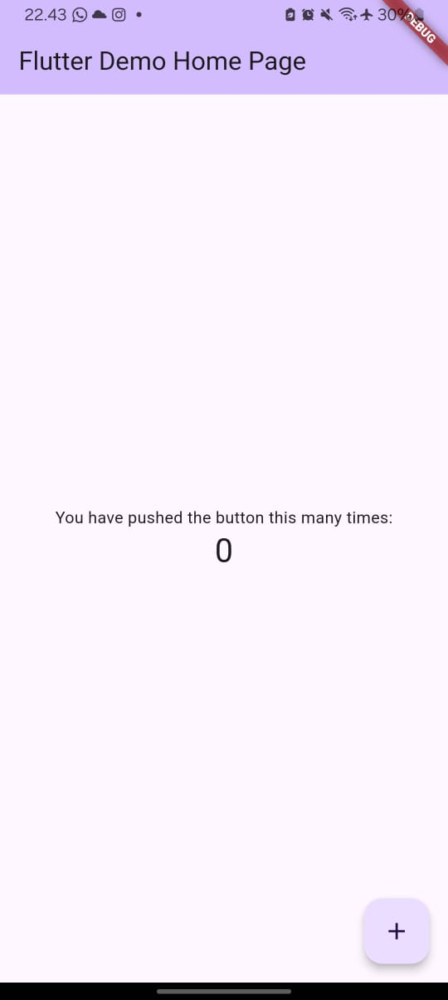
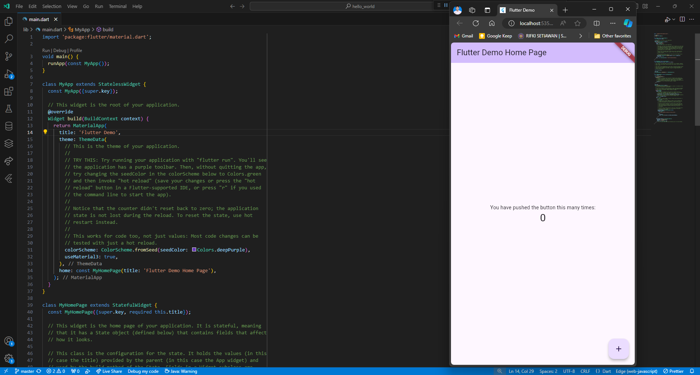
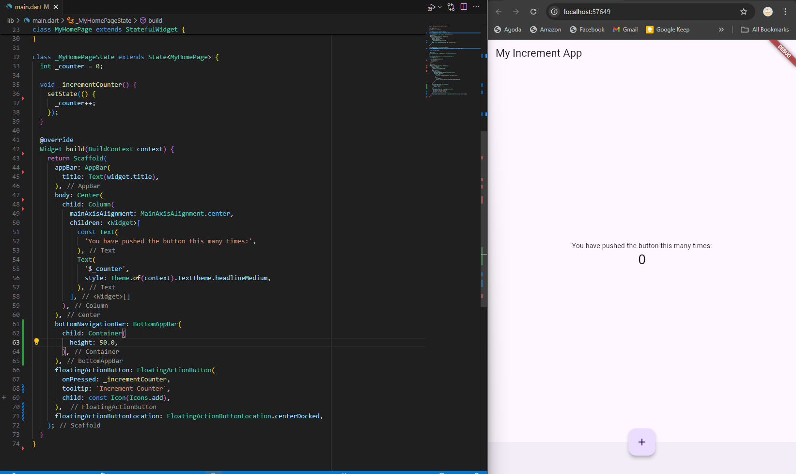
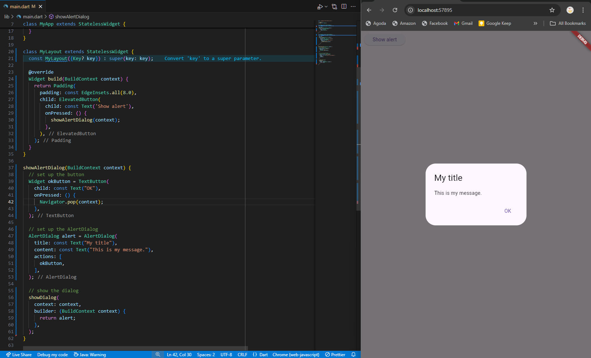
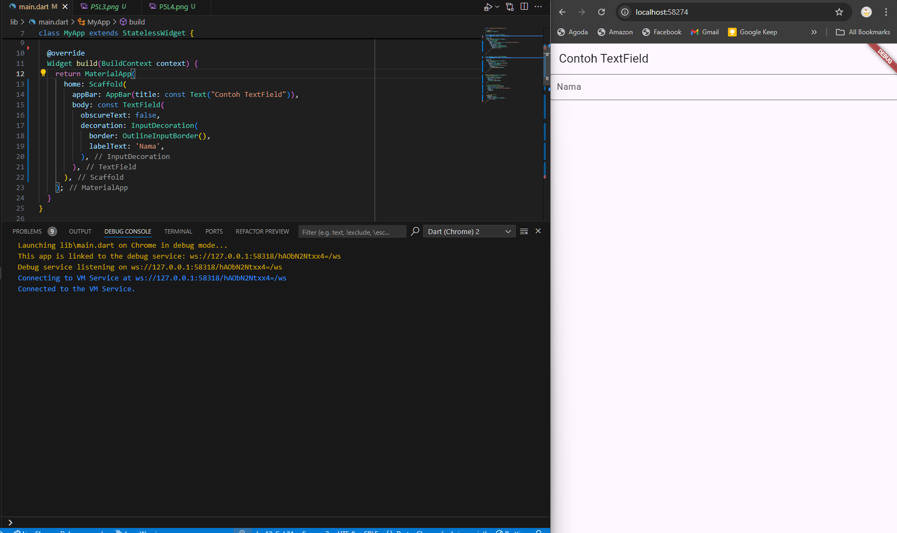
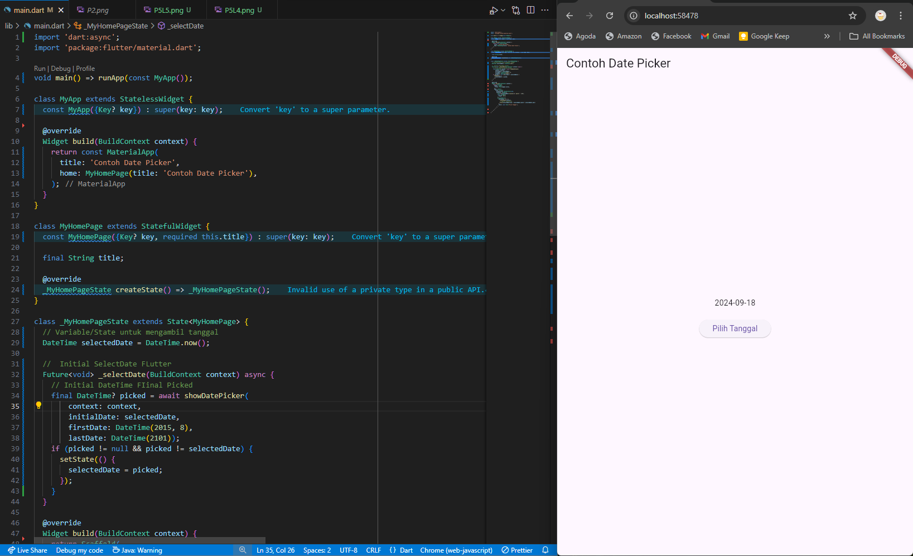

# Projct hello_world

Rifki Setiawan  
TI-3H

## Praktikum 1

## Praktikum 2
Menampilkan aplikasi pada handphone pribadi  

## Praktikum 3
Menjalankan Proyek Flutter  

## Praktikum 4

## Praktikum 5

Scaffold Widget  

  Dialog Widget  

  Input dan Selection Widget  

  Date dan Time Widget  

